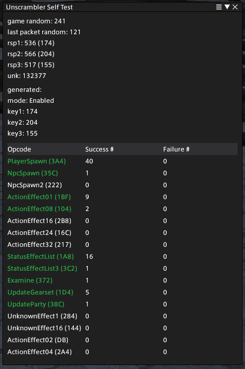

# Unscrambler
A library for deobfuscating packets for Final Fantasy XIV.

## What is this?
In 7.2 (2025.03.18.0000.0000), released 3/25/2025, Square Enix implemented obfuscation for specific packets used in the
game. Prior to 7.2, there were still a number of applications that used packet capture (Npcap, Sockets) rather than
hooking game functions, in order to obtain packet data from the game. In the time since the release of 7.2, most 
applications that utilize packet capture have moved on to using [Deucalion](https://github.com/ff14wed/deucalion). 
Deucalion itself has had to modify its approach to obtain packets after the game deobfuscates them. This library 
attempts to make packet deobfuscation as simple as possible and provide a reference for the constants and data that 
make up the obfuscation method.

## How does the obfuscation work?
A basic understanding of [XIV packet structure](https://xiv.dev/network/packet-structure) is necessary for the 
following explanation.

The game receives packets, commonly referred to as frames, in order to function. These frames contain many packets 
inside them, so the terminology might get a little confusing. We will be referring to the entire payload as a "frame",
each packet element inside of a frame as a "packet" and the headers will be called packet headers and IPC headers.

In 7.2, when the game processes a zone down packet, it's processed by the zone down handler. This is where the 
deobfuscation begins. See the decompilation below:

```c++
unsigned __int64 __fastcall Client::Network::PacketDispatcher_OnReceivePacket(
        PacketDispatcher *this,
        unsigned int targetId,
        __int64 packet)

    opcode = *(unsigned __int16 *)(packet + 2);
    data = (byte *)packet;
    if ( opcode == 636 ) // Check for the InitZone opcode
    {
        mode = *(_BYTE *)(packet + 37);
        seed0 = *(_BYTE *)(packet + 38);
        seed1 = *(_BYTE *)(packet + 39);
        seed2 = *(_DWORD *)(packet + 40);
    }
    else
    {
        if ( opcode != 702 ) // Unknown opcode
          goto LABEL_8;
        mode = *(_BYTE *)(packet + 22);
        seed0 = *(_BYTE *)(packet + 23);
        seed1 = *(_BYTE *)(packet + 24);
        seed2 = *(_DWORD *)(packet + 28);
    }
    negSeed0 = ~seed0;
    negSeed1 = ~seed1;
    negSeed2 = ~seed2;
    packetRand = rand() % 255 + 1;        // Generate a random value
    this->lastPacketRand = packetRand;    // Store it for use later
    
    // This is the value that determines if obfuscation is enabled
    // This changes every patch
    if ( mode == -32 )
    {
        // LocalRand is a random number generated in the constructor of PacketDispatcher
        localRand = this->localRand; 
        this->key0 = localRand + packetRand + derive(0, negSeed0, negSeed1, negSeed2);
        this->key1 = localRand + packetRand + derive(1, negSeed0, negSeed1, negSeed2);
        this->key2 = localRand + packetRand + derive(2, negSeed0, negSeed1, negSeed2);
    }
    else
    {
        // This essentially turns obfuscation off - the keys are just the random values added 
        this->key0 = rand() % (this->lastPacketRand + this->localRand);
        this->key1 = rand() % (this->lastPacketRand + this->localRand);
        this->key2 = rand() % (this->lastPacketRand + this->localRand);
    }
```

and the `derive` function:

```c++
__int64 __fastcall derive(char set, byte nSeed1, byte nSeed2, unsigned int epoch)
{
  if ( set )
  {
    if ( set == 1 )
    {
      seed1_ = nSeed1;
      daysValue = 3 * (epoch / 0x3C / 0x3C / 0x18);
      midIndex = 8LL * (nSeed1 % 0xD5u);
      v8 = table1[105 * (nSeed2 % 0x7Fu)
                         + *(_DWORD *)((char *)&midTable + midIndex) * (unsigned int)nSeed1 % 0x69];
    }
    else
    {
      if ( set != 2 )
        return 0;
      seed1_ = nSeed1;
      daysValue = 3 * (epoch / 0x3C / 0x3C / 0x18);
      midIndex = 8LL * (nSeed1 % 0xD5u);
      v8 = table2[101 * (nSeed2 % 0xFAu)
                         + *(_DWORD *)((char *)&midTable + midIndex) * (unsigned int)nSeed1 % 0x65];
    }
  }
  else
  {
    seed1_ = nSeed1;
    daysValue = 3 * (epoch / 0x3C / 0x3C / 0x18);
    midIndex = 8LL * (nSeed1 % 0xD5u);
    v8 = table0[116 * (nSeed2 % 0xA6u)
                       + *(_DWORD *)((char *)&midTable + midIndex) * (unsigned int)nSeed1 % 0x74];
  }
  return (unsigned __int8)(seed1_ + midTable[4 + midIndex] + dayTable[4 * (daysValue % 0x25)] + v8);
}
```

Cleaned up, this is, in C#:

```csharp
private void Derive(byte set, byte nSeed1, byte nSeed2, uint epoch)
{
    var midIndex = 8 * (nSeed1 % ((_midTable.Length / 8) - 1));
    var midTableValue = _midTable[4 + midIndex];
    var midValue = BitConverter.ToUInt32(_midTable, midIndex);
    
    var epochDays = 3 * (epoch / 60 / 60 / 24);
    var dayTableIndex = 4 * (epochDays % 37);
    var dayTableValue = _dayTable[dayTableIndex];

    var setRadix = _constants.TableRadixes[set]; // [116, 105, 101] 
    var setMax = _constants.TableMax[set];       // [166, 127, 250]
    var tableIndex = setRadix * (nSeed2 % setMax) + midValue * nSeed1 % setRadix;
    var setResult = set switch
    {
        0 => _table0[tableIndex],
        1 => _table1[tableIndex],
        2 => _table2[tableIndex],
        _ => 0,
    };
    
    return (byte)(nSeed1 + midTableValue + dayTableValue + setResult);
}
```

I don't know enough about cryptography to go into heavy detail here, so a basic explanation is that there are 5 
distinct components to the keys: nSeed1, midTableValue, dayTableValue, setResult, and of course, the tables themselves.

The first part is nSeed1, which is just sent to the client.

The second part is the "midtable". I called it this because it's used in the middle of the calculation of things. The 
table itself seems to be sets of 8 bytes, the first 4 of which are used as an index modifier for each set's table. The
second 4 are truncated to a byte, and used in the final key calculation for each set.

The third part is the "daytable". This is a set of 37 ints, and the index is the InitZone-provided epoch day times 3, 
mod 37. Again, the values seem to be constrained to a 2 byte maximum, but take up 4, and are truncated to 1.

The fourth part and fifth part is setResult and their tables. Each table is a varying size, but you can see in the 
middle of this excerpt that these values are defined as "radix" and "max". I don't know enough math to describe this 
well, but to me, it looks like these tables are indexes using custom bases. That is, seed2 defines the Nths place, 
and seed1 defines the N-1ths place, where N is `TableRadixes[set]`. Does this make sense? No idea, but 
`TableRadixes[0] * TableMax[0] = sizeof(table0) / 4` so it sure made sense to me. As for the values in these tables, I
have absolutely no idea what they are. They just look like random ints constrained to 2 bytes.

Finally, seed1 is added to midTableValue which is added to dayTableValue which is added to setResult, and all truncated 
into one byte. That is the key for this set.

You may have noticed the random numbers that are added to the result of the `derive` function. Here is the code that 
determines the key to use:

```c++
lastPacketRand = this->lastPacketRand;
localRand = this->localRand;
if ( this->rspSeed1 < localRand + lastPacketRand )
    goto LABEL_109;
keyToUse = *(&this->key0 + opcode % 3) - localRand - lastPacketRand;
```
The conditional here is what causes the "obfuscation disable" to work. If the mode in an InitZone is not the mode to 
use the derive function, the keys will always end up less than the sum of the two random values. Prior to use, the 
first key is always checked to see if it's lower than these two values. If it is, deobfuscation is skipped. If it
isn't, it continues, subtracting these values from the derived keys in order to use them. Finally, the key to use is 
determined by the obfuscated packet's opcode.

For an example, we will focus on PlayerSpawn as it's the most interesting and also the most simple.

Here is the decompilation:
```c++
case 0x3A4u:
  MemCpy(v131, data, 0x10A0u);
  *(_WORD *)&v131[36] -= key;
  data = v131;
  v74 = 0;
  *(_QWORD *)&v131[24] -= key;
  v75 = &v131[611];
  *(_WORD *)&v131[38] -= key;
  do
  {
    *(v75 - 1) -= key;
    v74 += 32;
    *v75 -= key;
    v75[1] -= key;
    v75[2] -= key;
    v75[3] -= key;
    v75[4] -= key;
    v75[5] -= key;
    v75[6] -= key;
    v75[7] -= key;
    v75[8] -= key;
    v75[9] -= key;
    v75[10] -= key;
    v75[11] -= key;
    v75[12] -= key;
    v75[13] -= key;
    v75[14] -= key;
    v75[15] -= key;
    v75[16] -= key;
    v75[17] -= key;
    v75[18] -= key;
    v75[19] -= key;
    v75[20] -= key;
    v75[21] -= key;
    v75[22] -= key;
    v75[23] -= key;
    v75[24] -= key;
    v75[25] -= key;
    v75[26] -= key;
    v75[27] -= key;
    v75[28] -= key;
    v75[29] -= key;
    v75[30] -= key;
    v75 += 32;
  }
  while ( v74 < 0x20 );
  v76 = 0;
  v77 = &v131[564];
  v78 = key + 118426275;
  do
  {
    *((_DWORD *)v77 - 2) ^= v78;
    v76 += 10;
    *((_DWORD *)v77 - 1) ^= v78;
    *(_DWORD *)v77 ^= v78;
    *((_DWORD *)v77 + 1) ^= v78;
    *((_DWORD *)v77 + 2) ^= v78;
    *((_DWORD *)v77 + 3) ^= v78;
    *((_DWORD *)v77 + 4) ^= v78;
    *((_DWORD *)v77 + 5) ^= v78;
    *((_DWORD *)v77 + 6) ^= v78;
    *((_DWORD *)v77 + 7) ^= v78;
    v77 += 40;
  }
  while ( v76 < 0xA );
  break;
```

As you can see, these loops actually do nothing. If we clean it up a little, we get the following:

```c++
case 0x3A4u:
  MemCpy(v131, data, 0x10A0u);
  *(_WORD *)&v131[36] -= key;
  data = v131;
  v74 = 0;
  *(_QWORD *)&v131[24] -= key;
  v75 = &v131[610];
  *(_WORD *)&v131[38] -= key;
  for (int i = 0; i < 32; i++) {
    v75[i] -= key;
  }
  
  v76 = 0;
  v77 = &v131[564];
  intKey = key + 118426275;
  for (int i = 0; i < 10; i++) {
    *(_DWORD *)v77 ^= intKey;
  }
  break;
```

That's a lot better, but let's make one last pass (for understanding, not for copy-pasting):

```c++
case 0x3A4u: // PlayerSpawn opcode
  *(int64 *)&data[24] -= key; // Content ID
  *(int16 *)&data[36] -= key; // Home world
  *(int16 *)&data[38] -= key; // Current world
  
  // Player Name
  for (int i = 610; i < 610 + 32; i++) {
    data[i] -= key;
  }
  
  // Player equipment
  intKey = key + 118426275;
  for (int i = 556; i < 556 + 10; i++) {
    *(int32 *)(data + i) ^= intKey;
  }
  break;
```

Now we can see that these weirdly decompiled cases are just unrolled loops, smashing the provided key together with 
areas in packets that Square Enix doesn't want you to see, I guess. Every other packet is like this, only 
deobfuscating specific fields. The full reimplementation of the deobfuscation is in this library.

## The Workaround, and "Why not hooking?"

Since the 7.2 updates that have made various tools compatible with these changes in the game, there have been a number
of reports of crashes when running two applications that use the "deobfuscation workaround" in unison.

Take a look at this decompilation:
```c++
  } // End deobfuscation switch
LABEL_108:
  CreateTargetIfNeeded(targetId);
  opcodeMinus101 = opcode - 101;
LABEL_110:
  v90 = v85;
  v89 = &_ImageBase;
  result = opcodeMinus101;
  switch ( opcodeMinus101 ) // Begin packet handler switch
```

Do you see it? Prior to this CreateTarget, as it's known, being called, the pointer to the deobfuscated data actually 
ends up in `rsi`. This means that if you can access `rsi` from a hook, you can simply read the deobfuscated packet 
from the pointer, deobfuscated by the game, always 100% correct. The problem that the community has encountered is 
that `rsi` might not be maintained between different applications hooking the same callsite - and libraries that 
perform hooking may do funky things in order to provide `rsi` from within your hook, which may cause problems for 
other applications hooking the same location. Furthermore, even if you do get the data from this position, there are a 
number of new concerns to address. Packet ordering is one, where in order to maintain the actual order of incoming and
outgoing frames, you must delay processing an early frame until CreateTarget is hit, so you can read the packet from
`rsi` and fill in the missing data before considering the frame complete. Another concern is actually bugs in the
game - there is a certain IPC packet the server sends the client every 10 seconds, and if you happen to switch zones
and receive a type 2 packet (IPC is type 3), the game will send you both in the same frame - but it will not call
CreateTarget on this IPC packet. If the game sends you this packet outside of a frame with a type 2 packet, it will 
call CreateTarget on it. I was tired of the constant workarounds to ensure the integrity of my data.

# Using the library

The functionality is condensed into two classes, `KeyGenerator` and `Unscrambler`.

You obtain a `KeyGenerator` like so:
```csharp
var keyGenerator = KeyGeneratorFactory.ForGameVersion("2025.03.27.0000.0000");
```
and you feed it InitZone packets like so:
```csharp
if (packet.Opcode == VersionConstants.ForGameVersion("2025.03.27.0000.0000").InitZoneOpcode) {
    keyGenerator.Generate(initZone);
    /*
    keyGenerator.DeobfuscationEnabled,
    keyGenerator.Keys[0],
    keyGenerator.Keys[1],
    keyGenerator.Keys[2]
    are all now set and ready to be used.
    */
}   
```

You obtain an instance of `Unscrambler` like so:
```csharp
var unscrambler = UnscramblerFactory.ForGameVersion("2025.03.27.0000.0000");
```
This is because the library will provide a dedicated implementation of IUnscrambler for each game version requested. 

You deobfuscate packets like so:
```csharp
var packetData = GetPacketData(); 
unscrambler.Unscramble(packetData, keyGenerator.Keys[0], keyGenerator.Keys[1], keyGenerator.Keys[2]);
```
The unscrambler will deobfuscate the packet in-place. Note that the provided data must start at the IPC header. Not 
after the IPC header, but at the IPC header, as the function will obtain the opcode by accessing `data[2]`.

## Extra considerations

The game client does not reset its generated keys between logins. Consider the following scenario:

1. Log in
2. Receive StatusEffectList3
   - This is not obfuscated, as you have just logged in and no keys have been generated
3. Receive InitZone
   - Keys are now generated
4. Do things in-game
5. Log out
6. Log in
7. Receive StatusEffectList3
   - This packet is obfuscated with keys from the last InitZone received
8. Receive InitZone
   - New keys have been generated

Furthermore, care must be taken when generating keys and processing packets at a later time. For example, you may get
into a situation where a packet is being deobfuscated with new keys due to an error in the order of operations of
generating keys and deobfuscating the packet.

# DataGenerator

This repository comes with a project called Unscrambler.DataGenerator. Provided the appropriate values, this 
application will read the necessary key derivation tables from the executable and dump them into files to be
included in the library as constants. It's provided for convenience and my own use for updating the library.

## Updating values for DataGenerator

DataGenerator requires a set of constants in order to run. These are the table offsets and the table sizes.

If you look at the `derive` function in IDA, you will see the 5 tables referenced in an obvious fashion. There is an
example of this above in this README. If you click through to any of the set tables, you will see something like:
```asm
; int table1[13336]
table1          dd 1617h                ; DATA XREF: derive+169↑r
                db    4
                db  0Ch
                db    0
                db    0
                db  70h ; p
```
This shows the position of the table in the executable, and the length of the table in 32-bit integers. However, you
can also use the set code to determine the length:

```c++
setResult = table1[105 * (nSeed2 % 0x7Fu) + *(_DWORD *)((char *)&midTable + midIndex) * (unsigned int)nSeed1 % 0x69];
```
`0x69 * 0x7F = 105 * 127 = 13335` (Not sure why it's off by one, I thought this worked perfectly)

These set values above are the radix and max for table1. Doing this for each table will give you 3 radixes and 3 maxes.

The daytable is likely not going to change in size, but IDA will also tell you that. Its size will likely stay 37 * 4 
bytes.

The midtable's size is important because the length is used in this library to replace a runtime constant. But, you can
also compute the size, either via IDA, or by looking at the decompilation:
```c++
midIndex = 8LL * (nSeed1 % 0xD5u);
```
This shows the midtable has a max index of 0xD5 (213), so it has 214 entries and has 8-byte entries. The size is
then 214 * 8 = 1712 bytes. The only odd thing is that IDA detects the beginning of the midtable as an int prior to an
array of bytes, so just know that the use of the midtable in the set calculation is the correct base, not the array
used in the return value, which is 4 bytes later.

# Self-Test

This repository comes with a project called Unscrambler.SelfTest. This is a Dalamud plugin that performs the 
aforementioned `rsi` hooking in order to obtain the properly deobfuscated data from the game. It also loads all of the
obfuscated opcodes and displays which opcodes were and were not successfully deobfuscated. The code is very messy, but
it was created to do one job and it does it well enough. It, again, is provided for convenience and my own use for
verifying that updated versions of the library are functioning as expected. If you are using this to test updates,
note that there is likely no way to get the server to send a select few opcodes.

A general guideline is as follows:
- PlayerSpawn: Change zone or encounter another player
- NpcSpawn: Encounter a monster (BNpc)
- ActionEffect01: Observe an action that affects 1 target
- ActionEffect08: Observe an action that affects 8 targets
- ActionEffect16: Observe an action that affects 16 targets
- ActionEffect24: Observe an action that affects 24 targets (hunts are good for this)
- ActionEffect32: Observe an action that affects 32 targets (hunts are good for this)
- StatusEffectList1: Observe a buff being applied
- StatusEffectList3: Observe many buffs being applied (?)
- Examine: Examine another player
- UpdateGearset: Switch gearsets
- UpdateParty: Observe a player join/leave your party, or switch zones
- NpcSpawn2: Does not seem to be sent to the client
- ActionEffect02: Does not seem to be sent to the client
- ActionEffect04: Does not seem to be sent to the client
- UnknownEffect1: Does not seem to be sent to the client
- UnknownEffect16: Does not seem to be sent to the client

